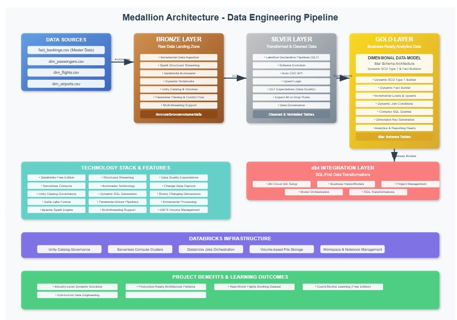
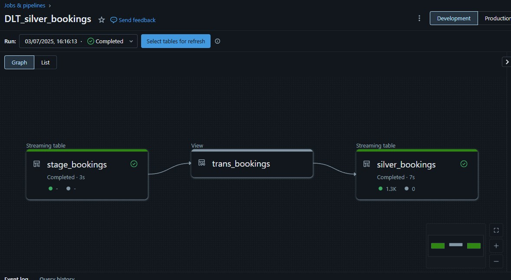
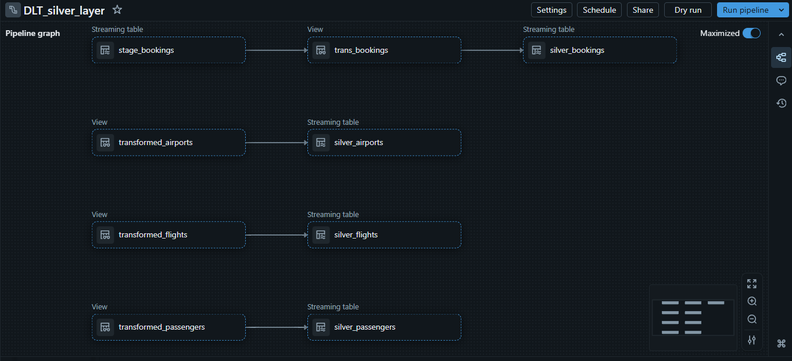

# DatabricksProject

# Project Overview
This comprehensive, industry-level data engineering project is  covers the entire data pipeline lifecycle, from raw data ingestion to building a refined gold layer and connecting with a popular transformation tool like dbt.
# Architecture

The project strictly adheres to the Medallion Architecture, organizing data into distinct layers: Bronze, Silver, and Gold. This layered approach ensures data quality, governance, and efficient processing.
•
Bronze Layer: The raw data landing zone, where files are incrementally ingested.
•
Silver Layer: The transformed and cleaned data layer, built using declarative pipelines.

## Delta Live Tables Pipeline (Silver Layer)

This shows the transformation logic handled declaratively using Databricks Lakeflow (DLT).

•
Gold Layer: The highly refined, business-ready data layer, structured for analytics and reporting.
Key Features & Technologies Mastered
This project offers hands-on experience with cutting-edge data engineering tools and concepts:
•
Incremental Data Ingestion: Learn to incrementally load data using Spark Structured Streaming and Databricks Autoloader for file-based sources.
•
Dynamic Solutions: Implement dynamic notebooks for bronze layer population, utilizing parameter parsing and control flow in Databricks Jobs.
•
Lakeflow Declarative Pipelines (DLT): Master the newly launched Lakeflow Declarative Pipelines (formerly Delta Live Tables) for building the Silver layer, including schema evolution and upsert logic using Auto CDC API.
•
Dimensional Data Modeling (Star Schema): Construct a Gold layer based on a dimensional data model. This includes:
◦
Dynamic Slowly Changing Dimensions (SCD) Type 1 Builder: A unique, industry-level solution that can automatically convert any source table into a Slowly Changing Dimension by simply passing parameters.
◦
Dynamic Fact Builder: A dynamic solution for building fact tables, handling incremental loads and upserts, by connecting to dynamically generated dimension keys.
•
Databricks Free Edition & Serverless Compute: Leverage Databricks Free Edition, which provides production-ready workspace features and serverless compute, enabling you to learn without cost barriers.
•
Unity Catalog & Volumes: Understand and utilize Unity Catalog for data governance and Volumes for managing file storage within Databricks, replacing traditional DBFS.
•
Data Quality with DLT Expectations: Implement data quality rules using DLT expectations (e.g., expect all or drop) to ensure data integrity.
•
Dynamic Join Conditions & Filters: Build complex dynamic SQL queries for joins and filters based on parameters, crucial for the Gold layer's dynamic builders.
•
Multi-threading: Explore the concept of multi-threading for running dynamic notebooks, offering an alternative to Databricks Jobs loops.
•
dbt Integration: Connect Databricks with dbt to perform data transformations using a SQL-first approach, creating business views/models on top of the Gold layer. Learn to set up dbt Cloud IDE, manage projects, and run dbt models.
Project Data
The project utilizes a Flights booking dataset, which includes both a fact table and three dimension tables. This dataset is chosen for its realism and includes scenarios for incremental loads and dimension modeling.
•
Fact Table: fact_bookings.csv (master data).
•
Dimension Tables:
◦
dim_passengers.csv
◦
dim_flights.csv
◦
dim_airports.csv
These files are structured to demonstrate incremental loading, slowly changing dimensions, and complex joins.

